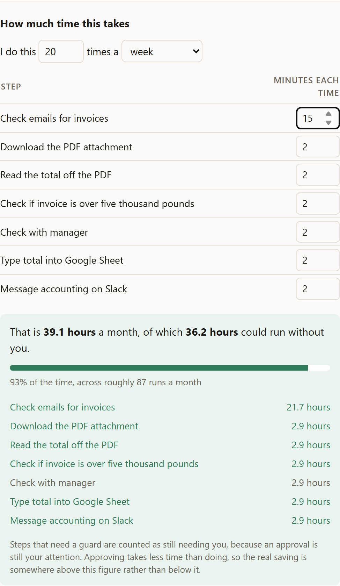

# Automation Architect

**Work out what is safe to automate before anybody builds it.**

**[Try it](https://ai-auto-architect.vercel.app).** Two worked examples, no sign-up, no API key.

You tell it what you do by hand. It works out the steps, judges which ones a computer
could take over, and, the part that matters, flags where a human has to stay in the
loop and why. Then it exports a workflow scaffold you can import into n8n.


---

## What it looks like

```
$ python scripts/analyse.py "Every morning I go through my emails looking for
  invoices. When I find one I download the PDF attachment, read the total off it,
  and type that into our Google Sheet. Then I message accounting on Slack to say
  it's in. If it's a big one, over five thousand pounds, I check with my manager
  first before I put it through."

Step 1 of 2: mapping the process
  attempt 1: accepted

INVOICE PROCESSING
Process inbound invoice emails every morning by downloading PDFs, logging them in a
Google Sheet, and notifying accounting, with manager sign-off for large invoices.

Trigger: Every morning I go through my emails looking for invoices. (schedule)
Systems: Email, Google Sheet, Slack

  [ ] check_emails  (read)
      Check emails for invoices
      assumed: The user reviews emails in an email client like Gmail or Outlook.
      -> download_pdf

  [ ] download_pdf  (write)
      Download the PDF attachment
      repeats for: each PDF attachment on the email
      -> read_total

  [ ] read_total  (extract)
      Read the total off the PDF
      -> check_amount_size

  [?] check_amount_size  (decision)
      Check if invoice is over five thousand pounds
      -> manager_check     if amount is over five thousand pounds
      -> enter_into_sheet  if amount is five thousand pounds or less

  [ ] manager_check  (judgement)
      Check with manager
      -> enter_into_sheet

  [ ] enter_into_sheet  (write)
      Type total into Google Sheet
      -> notify_accounting

  [ ] notify_accounting  (notify)
      Message accounting on Slack


Step 2 of 2: judging what can be automated
  attempt 1: accepted

Most of the invoice collection, logging, and notification can be fully automated,
leaving only the manager's sign-off on large invoices to be handled by a person.

[ auto  ]  check_emails
            A computer can look for new emails and spot incoming invoices without
            you needing to do it yourself.

[ auto  ]  download_pdf
            An automated rule can grab and save the PDF attachment from the email
            the moment it arrives.

[ auto  ]  read_total
            Optical character recognition can easily read the total amount due
            straight off the invoice PDF.

[ auto  ]  check_amount_size
            A simple arithmetic check can instantly tell whether the invoice total
            is greater than five thousand pounds.

[  you  ]  manager_check
            This is a person checking and signing something off, which is the point
            of the step.
            risks: subjective_judgement

[ auto  ]  enter_into_sheet
            A script can type the invoice total directly into your Google Sheet
            without any manual copying.

[ auto  ]  notify_accounting
            An automated message can be sent straight to accounting on Slack as
            soon as the invoice is logged.

Runs on its own: 6   Needs a guard: 0   Stays with you: 1   Unclear: 0
Start with: check_emails
```

### And when nothing stops for a human

The interesting case. Same tool, a process with no approval step in it:

```
$ python scripts/analyse.py "Every Friday I go through the supplier invoices
  sitting in our shared inbox. I read the amount off each one, pay it straight
  from our business account through the banking portal, mark it as paid in the
  spreadsheet, and then delete the email to keep the inbox tidy."

FRIDAY SUPPLIER INVOICE PAYMENT

  ... process map omitted ...

  Worth asking before building anything:
    - Do invoices need any manager approval before they are paid?
      why: If approval is required, an approval step needs to be added before payment.
      e.g. No, I pay them straight away / Yes, approval is needed for amounts over
           a certain limit / Yes, all invoices need approval

Step 2 of 2: judging what can be automated
  attempt 1: accepted

You can automate the reading, spreadsheet logging, and tidying of invoices, but
actual money transfers will still wait for your final click.

[ auto  ]  open_inbox
[ auto  ]  get_next_invoice
[ auto  ]  read_amount

[ guard ]  pay_invoice
            It can set up the payment for you, but actual money leaving your bank
            account should never happen completely unattended.
            risks: moves_money, irreversible
            -> human_approval
               Added automatically: this step was judged to need a guard, but none
               was specified. Defaulting to asking a person, which is the safe
               assumption.

[ auto  ]  mark_as_paid

[ guard ]  delete_email
            Once the payment is done and logged, a computer can move or delete the
            email to keep things tidy. Flagged automatically from what this step
            does, rather than by judgement.
            risks: irreversible
            -> human_approval

Runs on its own: 4   Needs a guard: 2   Stays with you: 0   Unclear: 0
Start with: pay_invoice
```

Two different mechanisms are visible there. The model worked out by itself that money
leaving an account is different from updating a spreadsheet, and noticed the
description never mentioned an approval step, so it asked.

It did not notice that deleting an email cannot be undone. That one was caught in
code, which is why it says so.

---

## The web version

The same pipeline behind a page: type a description, get the process as a diagram
with each step colour coded, and a panel explaining every verdict. Steps needing a
guard are listed first, because a list that opens with six green rows buries the one
thing the reader has to decide about.

```bash
# API
cd backend
.venv/Scripts/python -m uvicorn app.api:app --port 8000

# Front end, in a second terminal
cd frontend
npm install
npm run dev
```

Then open http://localhost:5173. The two examples on the page are recorded, so they
work with no API key.

## How much time it takes



You tell it how often you do the process and roughly how long each step takes. It
multiplies.

That sounds trivial and it is the point. A model will happily report that a process
takes 11.5 hours a month and is 71% automatable, and those figures are invented.
Anyone who stops to ask where they came from discounts the whole output, including
the parts that were sound. The two facts here come from the person doing the work,
so the arithmetic is theirs.

It also earns its place as interface. Typing "I do this twenty times a week and it
takes six minutes" tends to be the moment someone realises they have a problem worth
solving.

Steps needing a guard count as still needing you, since an approval is still your
attention. Approving takes less time than doing, so the real saving sits above the
figure shown rather than below it. Understating is the honest direction to be wrong
in.

## Sharing it

The **Share** button stores the analysis and gives you a link. Whoever you send it
to sees the process, the verdicts and your time figures, without needing the tool or
a key.

That matters more than it sounds for something meant to start conversations. The
person who decides whether to automate a process is usually not the person who does
it, and "have a look at this" beats a screenshot.

Three things the storage has to get right, because a shared analysis describes how
somebody's business actually runs:

- **Identifiers are unguessable.** Sequential ids would let anyone walk the table and
  read every process ever analysed.
- **Shares expire after 30 days.** An unlisted link that lives forever is a slow
  leak, and nobody goes back to tidy up. Expired rows are swept on the way past, so
  nothing needs scheduling.
- **Payloads are capped.** A public write endpoint with no limit is somebody else's
  free storage.

The interface says plainly that the link is readable by anyone holding it, and warns
against sharing one containing customer names. Unlisted is not the same as private.

Two stores sit behind one interface, because the right answer changes with where it
runs. On a machine with a disk it is SQLite: boring, no configuration, no account,
and a handful of small rows does not justify a database server. Deployed, there is no
disk that survives a request, so the same interface is served by blob storage
instead. `open_store()` picks from the environment and nothing above it knows which
it got.

Both go through one function that builds the record, so the id length, the expiry and
the size cap cannot drift apart between them. Those three are the security
properties, and an implementation quietly enforcing its own version of them is how a
rule becomes a suggestion.

The alternative was putting the whole analysis inside the link, which needs no
storage at all. Measured before choosing: an analysis compresses to about 2,200
characters, and the only remaining thing big enough to cut is the explanation text,
which is the product. A tidy link won.

## Exporting it

The **Export to n8n** button produces a workflow file that imports cleanly. It is a
scaffold, not a running automation, and it says so on every node.

That is deliberate. Guessing that someone means Gmail rather than Outlook or IMAP,
then inventing the credentials and field mappings to match, produces a file that
imports and fails in ways that are tedious to unpick. A skeleton with honest
placeholders beats a confident wrong answer.

What it does get right:

- The shape. Steps, branches, and the order they run in.
- Decisions become real IF nodes, not comments.
- Approvals become real Wait nodes, so the pause is in the workflow rather than in a
  paragraph somebody has to remember to read.
- A threshold approval becomes an IF on the threshold, so "only above 5,000" is
  encoded rather than described. This is what the structured threshold on a control
  is for.
- Every placeholder carries a note saying what to replace it with.

From the command line:

```bash
.venv/Scripts/python scripts/analyse.py --replay --export-n8n workflow.json
```

## How it works

```
Plain English
      |
      v
 [ MODEL ]   fills in a structured form        <- stage 1: describe
      |
      v
 [ CODE  ]   validates the process graph
      |
      +-- broken? send the faults back and ask again
      |
      v
 [ MODEL ]   judges each step                  <- stage 2: decide
      |
      v
 [ CODE  ]   cross-checks against the graph
      |
      v
 Process map + verdicts + controls
```

Two model calls, not one. Asking a single prompt to both *understand* a process and
*judge* it does each job worse than asking twice.

## The parts worth looking at

**Structural rules the model cannot talk its way out of.**
A step where the process branches must have at least two ways out, each saying what
decides it. Models flatten decisions into straight lines constantly, so it is enforced
in [`process.py`](backend/app/schemas/process.py) rather than requested in a prompt.

**A house rule on risk.**
Any step that moves money, cannot be undone, or carries legal weight can never be
marked fully automatic, regardless of how confident the model was. See
`NEVER_FULLY_AUTOMATIC` in [`assessment.py`](backend/app/schemas/assessment.py).
Guard rails belong in code, not in prompt text.

**Validation that reports every fault at once.**
The validators return a list rather than raising on the first problem, because the
consumer is a repair loop, not a person. A loop that sees one fault per round trip
fixes it, breaks another, and oscillates.

**Repair prompts that say how to fix it.**
An error message reading "that is invalid" produces the same invalid answer again.
Every message names the valid ways out. This was learned the hard way, see the
commit history.

**Risk detection that does not depend on the model noticing.**
The house rule above only fires once a risk is flagged, and that was left entirely
to judgement. It marked "delete the email" as safe to run unattended. Obvious cases
are now caught by looking at what the step says it does, before the model's verdict
is considered. Deliberately crude word matching, because a safety net needs to be
predictable and explainable more than it needs to be clever. It is also careful
about the difference between doing a thing and recording that it happened: "mark as
paid" writes a spreadsheet row, it does not touch a bank account.

**Failing safe rather than closed.**
Smaller models regularly flag a step as needing a guard and then forget to attach
one. Rejecting the whole analysis over that throws away work that was otherwise
correct. Instead a conservative control is inserted, labelled plainly as having been
added automatically. A step that needed an approval and gets one is right. A step
that needed one and gets nothing is how money leaves an account unattended.

**A guard against loops that are not converging.**
If the same complaint comes back twice running, it stops rather than spending more
of a metered quota on an answer that is not changing.

**A provider seam.**
Nothing outside [`llm/gemini.py`](backend/app/llm/gemini.py) knows which model
provider is in use. Swapping it is one file.

**Record and replay.**
Every real call is saved. Two curated cases live in `backend/recordings/`, so
`--replay` reproduces either example above with no network and no API key. The tests
use the same idea with a scripted stand-in.

**Tests that agreed with the bug.**
Shared analyses were written to blob storage correctly and never read back. The
fetch returned 200, the body was there, and the code looked for it under a name it
does not have: the published examples are all of the asynchronous client, which
streams the body, while a request handler uses the synchronous one, which returns
it whole. Every test passed throughout, because the fake was written from the same
examples as the code and was wrong in the same direction. The fake now mirrors the
real type, and a test reads the library's own annotations so the two drifting apart
is itself a failure. A stand-in built from the same assumption as the code under
test does not check the assumption.

**A scored eval suite, with the failures left in.**
[`backend/evals/`](backend/evals/) grades properties rather than exact output, tests
both directions of the risk detector, and keeps known gaps visible instead of quietly
deleting them. See [Measuring it](#measuring-it).

## Try it

No API key needed. Two recorded cases ship with the repo:

```bash
cd backend
python -m venv .venv
.venv/Scripts/python -m pip install -r requirements.txt

.venv/Scripts/python scripts/analyse.py --replay
.venv/Scripts/python scripts/analyse.py --replay payment-no-approval
```

To run it against your own description you need a free
[Google AI Studio](https://aistudio.google.com) key:

```bash
setx GEMINI_API_KEY "your-key"
# open a new terminal, then:
.venv/Scripts/python scripts/analyse.py "describe something repetitive you do"
```

## Tests

```bash
cd backend
.venv/Scripts/python -m pytest
```

144 tests, none of which call an API. The model is substituted with a scripted
stand-in that returns deliberately broken output, so the repair loop can be tested
precisely and for free.

## Measuring it

Tests answer whether the code does what it was told. They cannot answer whether the
judgement is any good, and that is the half that degrades quietly. So there is a
separate scored suite:

```bash
cd backend
.venv/Scripts/python scripts/eval.py          # the safety net, free and instant
.venv/Scripts/python scripts/eval.py replay   # the pipeline, recorded answers
.venv/Scripts/python scripts/eval.py live     # the pipeline, real model
```

It exits non-zero on a failure or a regression against the committed baseline, so it
can sit in a build.

Nothing in it matches exact output. Two good answers never match word for word, and a
suite built that way fails whenever somebody rephrases anything, which teaches you
nothing and gets switched off. Every check asserts a property instead: *the step that
deletes something did not come back safe to run unattended*, which holds however the
model worded it.

The three modes measure different things, and the difference is worth being straight
about. `guards` runs our own risk detection with no model involved, so it is free and
identical every time. `replay` runs the whole pipeline against saved responses, which
catches the day a schema change stops us reading an answer that used to be fine, but
**cannot tell you a prompt improved**, because the saved answer came from the old
prompt. Only `live` can do that.

Two things worth noting:

**It tests both directions.** A risk detector that flags everything catches every
real risk and is worthless, so nearly half the cases are harmless steps that must
stay quiet. "Mark the payment as received" and "Log the payment reference" are as
much the point as "Pay the contractor invoice". The run reports the two separately,
because one number hides which way it is failing.

**Failures get written down, not deleted.** A case can be marked a known gap: still
run, still scored, still printed, but not breaking the build, and the run says so
loudly if one starts passing. Deleting the failing case is the easiest way to make a
score go up, so a case that vanishes from the baseline counts as a regression.

Building it found two real holes, which is the entire argument for having it.

`legal_or_compliance` was one of the three risks in the never-fully-automatic rule
and had no code behind it at all, exactly the arrangement that let "delete the email"
through. Signing an agreement, serving notice and terminating a tenancy are now
caught on the leading verb, so filing a signed agreement stays clerical.

Three money cases then failed honestly for a fortnight's worth of reasons: writing
off a balance, issuing a credit note and releasing a deposit are all money moving,
and every single word in them is too common to match on. "Balance" is in every
reconciliation step, "credit" is in every credit check, and you release listings,
keys and reports as happily as you release funds. They are now matched as ordered
phrases, which is why "note the credit check" stays quiet: same two words, wrong
order, different thing.

## Status

Working: the two-stage pipeline, validation, repair, record/replay, a web front end
with the process rendered as a diagram, the time arithmetic, shareable links, export
to n8n, and a scored eval suite with committed baselines.

Live at [ai-auto-architect.vercel.app](https://ai-auto-architect.vercel.app).

## Deploying it

One Vercel project serves both halves. The API is the same FastAPI app, and the built
front end is served from it, so there is no second deployment to keep in step and no
cross-origin anything.

```bash
npm i -g vercel
vercel          # first run creates and links the project
vercel --prod   # the public URL
```

Three things to know.

**`/s/abc123` is a route the browser understands and the server has never heard of.**
Opening a shared link directly would 404 without a fallback, which is the failure
nobody catches in development because the dev server handles it silently. The app
serves `index.html` for unmatched paths, and API routes take priority regardless of
declaration order.

**Shared links need blob storage attached**, because serverless has no disk that
survives a request. Add one in the Vercel dashboard under Storage, and it injects
`BLOB_READ_WRITE_TOKEN`, which is what `open_store()` looks for. Without it the app
still runs and still analyses; only sharing is unavailable. 1GB covers roughly
140,000 shares, which is comfortably inside the free allowance.

**A model key is optional and deliberately left off the public demo.** Without
`GEMINI_API_KEY` the recorded examples work exactly as they do locally, and a typed
description gets a plain message saying so. A public box wired to a metered key is a
quota someone else gets to spend.

Built with Python, Pydantic and Gemini on the back end, React and React Flow on the
front. British English throughout, and the example
figures are in pounds, because that is who it is for.

## Licence

MIT. See [LICENSE](LICENSE).
