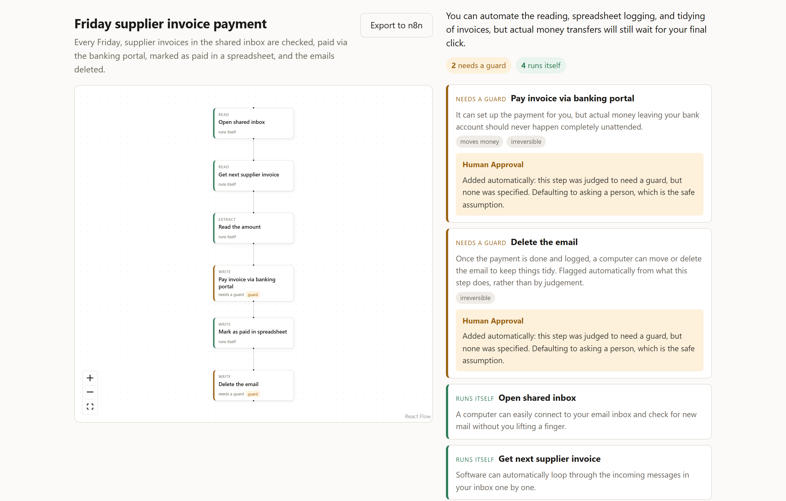

# Automation Architect

**Work out what is safe to automate before anybody builds it.**

**[Try it](https://ai-auto-architect.vercel.app).** Two worked examples, no sign-up, no API key.

Describe a job you do by hand. It maps the steps, judges which ones a computer could
take over, and refuses to call a step safe if it moves money, cannot be undone, or
carries legal weight. That refusal lives in code, not in the prompt, and a scored eval
suite checks that it holds.



## The one rule

**The model understands. The code checks.**

Ask a chatbot to design an automation and it will happily design one that pays a
supplier and deletes the evidence afterwards. Here the model's verdict is an input,
not the decision. A step that moves money, cannot be undone or carries legal weight
can never come back marked safe to run unattended. See `NEVER_FULLY_AUTOMATIC` and
`mandatory_risks` in [`assessment.py`](backend/app/schemas/assessment.py).

The same split runs through the rest. Time figures come from you, not the model. The
n8n export only uses a real node where you named the system.

## What it catches

A payment process with no approval step anywhere in it (trimmed):

```
$ python scripts/analyse.py --replay payment-no-approval

[ guard ]  pay_invoice
            risks: moves_money, irreversible
            ! we changed this: no guard -> human_approval

[ guard ]  delete_email
            risks: irreversible
            ! we changed this: nothing flagged -> irreversible
            ! we changed this: fully_automatable -> automatable_with_control
            ! we changed this: no guard -> human_approval

Runs on its own: 4   Needs a guard: 2   Stays with you: 0   Unclear: 0
```

Every `!` line is the code overruling the model. On the payment, the model spotted the
risk but forgot to attach the guard it called for. On deleting the email it was wrong
three times over, and each rule caught what the one before let through. The rules are
`_normalise` in [`assess.py`](backend/app/assess.py), and only code writes the record
of what changed.

## How it works

```
                          Plain English
                               |
            +------------------+------------------+
            |                                     |
            v                                     v
   THE SLOW PATH                          THE FAST PATH
   two model calls, 10 to 20s             one embedding, about 1s

 [ CODE  ] is this a description?       [ CODE  ] vector for the text
     |     no -> say so, stop                |
     v                                       v
 [ MODEL ] fills in a structured form    [ CODE  ] compare with 12 articles
     |                                       |
     v                                       v
 [ CODE  ] validates the graph           [ CODE  ] above the threshold?
     |                                       |     no -> show nothing
     +-- broken? hand back the faults        v
     |   and ask again                   The article for this job
     v
 [ MODEL ] judges each step
     |
     v
 [ CODE  ] adds missed risks, downgrades,
     |     adds guards, records each change
     v
 Process map + verdicts + controls
```

Every CODE box is a decision the model does not get to make. The two paths are
separate requests, so the article still arrives when the model is slow or down.

## What else it does

- **Finds the article for the job.** Twelve written articles; the closest is shown
  beside your process, and it usually mentions the step you forgot. The whole library
  is listed under the box, so when nothing matches the page can say so plainly.
- **Takes answers to its own questions.** Answer one and the process is mapped again,
  with your answer treated as fact.
- **Does the time arithmetic with your numbers.** How often, how long per step. It
  will not guess them for you.
- **Shares a link.** Unguessable id, expires after 30 days.
- **Hands over to n8n.** A skeleton workflow on your clipboard, with real IF and Wait
  nodes, and labelled placeholders wherever a guess would be wrong.
- **Keeps your draft.** In your own browser only, for 7 days.

## Retrieval, measured

Two retrievers, scored on the same 22 labelled queries. Eight of them must return
nothing.

| retriever  | right (of 14) | stayed quiet (of 8) | total |
| ---------- | ------------- | ------------------- | ----- |
| bm25       | 10            | 8                   | 18    |
| embeddings | 13            | 8                   | 21    |

Embeddings are used, with BM25 as the fallback when there is no key or network. Both
thresholds were swept, and each sits where it never shows an irrelevant article rather
than where it scores highest. There is no vector database: 12 articles at 768
dimensions is a 160KB file and a loop.

## Tests and evals

```bash
cd backend
.venv/Scripts/python -m pytest                   # 308 tests, no API calls
.venv/Scripts/python scripts/eval.py             # the safety net, free and instant
.venv/Scripts/python scripts/eval.py replay      # the pipeline, recorded answers
.venv/Scripts/python scripts/eval.py playbooks   # retrieval, free and instant
.venv/Scripts/python scripts/eval.py live        # the pipeline, real model
```

Checks assert properties, not exact wording: "the step that deletes something did not
come back safe", however the model phrased it. Nearly half the cases are harmless
steps that must stay quiet, because a detector that flags everything is worthless.
Known gaps stay in the suite and are reported, rather than deleted. It exits non-zero
on a regression, so it can run in a build.

Building it found two real holes: a risk on the never-safe list with no code behind
it, and three money phrases nothing matched.

## Choosing the model

The same five live cases on each model, on the evening of 24 September 2026. Cost is
at the paid rate on Google's pricing page that day; the free tier costs nothing until
its daily allowance runs out.

| model | checks passed | could not run | time per analysis | calls | thinking tokens | cost per 1,000 analyses |
| --- | --- | --- | --- | --- | --- | --- |
| gemini-3.5-flash-lite | 24 of 26 | 0 | 14.8s | 2 | 0 | $4.66 |
| gemini-3.1-flash-lite | 19 of 21 | 1 | 24.0s | 2 | 0 | $2.72 |
| gemini-3.8-flash | none ran | 2 | n/a | n/a | n/a | n/a |

- **Flash-Lite 3.5 stays.** It is the only model that finished every case, and the
  quickest.
- **Flash-Lite 3.1** is cheaper but slower, and one analysis ran past the 100 second
  limit.
- **Flash 3.8 thinks before it answers.** On the one call it finished, 2,446 thinking
  tokens against 1,626 of answer. Its first analysis ran out of time and its free
  allowance ran out during the second.
- **Not measured:** Flash 3.5, whose free allowance of 20 requests a day was already
  used, and Flash-Lite 2.5, which is closed to new users.

```bash
.venv/Scripts/python scripts/bakeoff.py --ipv4 gemini-3.5-flash   # after the daily reset
.venv/Scripts/python scripts/bakeoff.py --table
```

The live baseline records which model produced it, so a later run on a different
model says so rather than reporting a regression in the code.

## Run it

The two recorded cases need no key:

```bash
cd backend
python -m venv .venv
.venv/Scripts/python -m pip install -r requirements.txt
.venv/Scripts/python scripts/analyse.py --replay payment-no-approval
```

With a free [Google AI Studio](https://aistudio.google.com) key, on your own words:

```bash
setx GEMINI_API_KEY "your-key"
# open a new terminal, then:
.venv/Scripts/python scripts/analyse.py "describe something repetitive you do"
```

The web version, in two terminals:

```bash
cd backend
.venv/Scripts/python -m uvicorn app.api:app --port 8000
```

```bash
cd frontend
npm install
npm run dev
```

Then open http://localhost:5173.

## Deploying it

One Vercel project serves the API and the built page together.

```bash
npm i -g vercel
vercel          # first run creates and links the project
vercel --prod   # the public URL
```

- **Shares need blob storage.** Add it under Storage in the Vercel dashboard, which
  sets `BLOB_READ_WRITE_TOKEN`. Without it, everything except sharing still works.
- **A model key is optional.** Without `GEMINI_API_KEY` the recorded examples still
  work and typed descriptions get a plain message. With one, anybody using the page
  spends your quota.
- **One deadline per request.** Every model call, repair and retry shares 100
  seconds, inside the 120 the platform allows, so a slow reply ends in a plain
  message rather than a 504.

## Where your data goes

| what                    | where                        | how long |
| ----------------------- | ---------------------------- | -------- |
| your draft              | your own browser             | 7 days   |
| a share link            | Vercel Blob, unguessable id  | 30 days  |
| anything else you type  | not kept; no accounts        | not kept |

## Status

Working: the full pipeline, the web page, retrieval, answerable questions, time
figures, sharing, the n8n handover and the eval suite.

The model is Gemini Flash-Lite. Measured on the real workload, a full analysis takes
about 20 seconds. Flash was slower on the same work, and its free tier allows only 20
requests a day.

## Licence

MIT. See [LICENSE](LICENSE).
